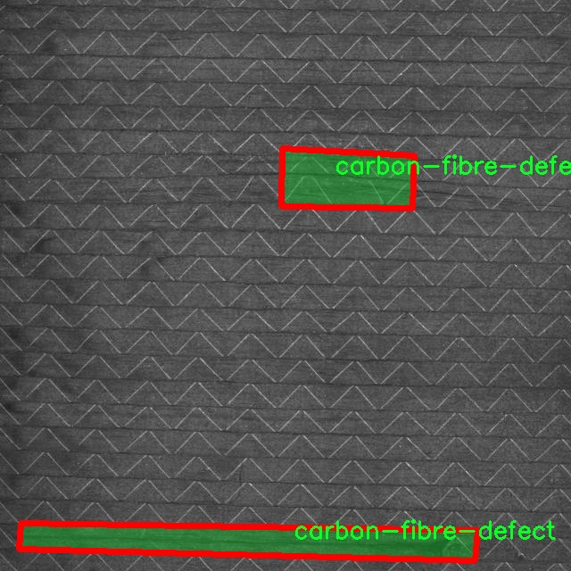

### 1.背景意义

研究背景与意义

随着现代工业的发展，碳纤维材料因其优异的强度与轻量化特性，广泛应用于航空航天、汽车制造及体育器材等领域。然而，碳纤维在生产和加工过程中，常常会出现各种缺陷，如气泡、裂纹和纤维断裂等，这些缺陷不仅影响产品的性能和安全性，还可能导致严重的经济损失。因此，及时、准确地检测碳纤维缺陷成为了一个亟待解决的技术难题。

传统的碳纤维缺陷检测方法多依赖人工目视检查或简单的机器检测，这些方法不仅效率低下，而且容易受到人为因素的影响，导致漏检或误检。随着计算机视觉技术的快速发展，基于深度学习的自动化检测方法逐渐成为研究热点。YOLO（You Only Look Once）系列算法因其高效的实时检测能力，成为了目标检测领域的重要工具。特别是YOLOv11的出现，进一步提升了检测精度和速度，为碳纤维缺陷检测提供了新的可能性。

本研究旨在基于改进的YOLOv11算法，构建一个高效的碳纤维缺陷检测系统。我们将利用一个包含84张标注图像的数据集，该数据集专注于碳纤维缺陷的检测，类别数量为1，涵盖了所有相关缺陷。通过对该数据集的深入分析与训练，我们期望能够提升检测系统的准确性和鲁棒性，从而为碳纤维材料的质量控制提供有效的技术支持。

本项目的研究不仅具有重要的理论意义，也具有广泛的应用前景。通过实现高效的碳纤维缺陷检测系统，可以显著提高生产效率，降低人工成本，确保产品质量，进而推动相关行业的技术进步与创新发展。

### 2.视频效果

[2.1 视频效果](https://www.bilibili.com/video/BV1YkSPYeE2U/)

### 3.图片效果


##### [项目涉及的源码数据来源链接](https://kdocs.cn/l/cszuIiCKVNis)**

注意：本项目提供训练的数据集和训练教程,由于版本持续更新,暂不提供权重文件（best.pt）,请按照6.训练教程进行训练后实现上图演示的效果。

### 4.数据集信息

##### 4.1 本项目数据集类别数＆类别名

nc: 1
names: ['carbon-fibre-defect']


该项目为【图像分割】数据集，请在【训练教程和Web端加载模型教程（第三步）】这一步的时候按照【图像分割】部分的教程来训练

##### 4.2 本项目数据集信息介绍

本项目数据集信息介绍

本项目所使用的数据集专注于碳纤维缺陷的检测，旨在为改进YOLOv11模型提供高质量的训练素材。该数据集的主题为“carbon fiber defect”，专门收集了与碳纤维材料相关的各种缺陷样本，以支持深度学习模型在实际应用中的准确性和鲁棒性。数据集中包含的类别数量为1，具体类别为“carbon-fibre-defect”，这意味着所有的样本均围绕这一特定缺陷展开，确保了数据集的专一性和针对性。

在数据收集过程中，我们从多个来源获取了大量的碳纤维缺陷图像，这些图像涵盖了不同类型的缺陷，包括但不限于裂纹、气泡、分层和其他可能影响碳纤维性能的缺陷。这些图像不仅包括了不同的拍摄角度和光照条件，还考虑了各种背景和环境因素，以提高模型的泛化能力。每个图像都经过精细标注，确保缺陷区域的准确定位，从而为YOLOv11的训练提供了高质量的监督信号。

此外，数据集的构建过程中还特别关注了样本的多样性和代表性，以便在训练过程中能够涵盖广泛的实际应用场景。这种多样性将有助于模型在面对不同类型的碳纤维缺陷时，能够做出更为准确的判断和检测。通过这种方式，我们希望能够显著提升YOLOv11在碳纤维缺陷检测任务中的性能，推动相关领域的技术进步与应用落地。最终，经过训练和优化的模型将为工业界提供更为高效和可靠的碳纤维质量检测解决方案。





### 5.全套项目环境部署视频教程（零基础手把手教学）

[5.1 所需软件PyCharm和Anaconda安装教程（第一步）](https://www.bilibili.com/video/BV1BoC1YCEKi/?spm_id_from=333.999.0.0&vd_source=bc9aec86d164b67a7004b996143742dc)


[5.2 安装Python虚拟环境创建和依赖库安装视频教程（第二步）](https://www.bilibili.com/video/BV1ZoC1YCEBw?spm_id_from=333.788.videopod.sections&vd_source=bc9aec86d164b67a7004b996143742dc)

### 6.改进YOLOv11训练教程和Web_UI前端加载模型教程（零基础手把手教学）

[6.1 改进YOLOv11训练教程和Web_UI前端加载模型教程（第三步）](https://www.bilibili.com/video/BV1BoC1YCEhR?spm_id_from=333.788.videopod.sections&vd_source=bc9aec86d164b67a7004b996143742dc)


按照上面的训练视频教程链接加载项目提供的数据集，运行train.py即可开始训练



     Epoch   gpu_mem       box       obj       cls    labels  img_size
     1/200     20.8G   0.01576   0.01955  0.007536        22      1280: 100%|██████████| 849/849 [14:42<00:00,  1.04s/it]
               Class     Images     Labels          P          R     mAP@.5 mAP@.5:.95: 100%|██████████| 213/213 [01:14<00:00,  2.87it/s]
                 all       3395      17314      0.994      0.957      0.0957      0.0843

     Epoch   gpu_mem       box       obj       cls    labels  img_size
     2/200     20.8G   0.01578   0.01923  0.007006        22      1280: 100%|██████████| 849/849 [14:44<00:00,  1.04s/it]
               Class     Images     Labels          P          R     mAP@.5 mAP@.5:.95: 100%|██████████| 213/213 [01:12<00:00,  2.95it/s]
                 all       3395      17314      0.996      0.956      0.0957      0.0845

     Epoch   gpu_mem       box       obj       cls    labels  img_size
     3/200     20.8G   0.01561    0.0191  0.006895        27      1280: 100%|██████████| 849/849 [10:56<00:00,  1.29it/s]
               Class     Images     Labels          P          R     mAP@.5 mAP@.5:.95: 100%|███████   | 187/213 [00:52<00:00,  4.04it/s]
                 all       3395      17314      0.996      0.957      0.0957      0.0845


###### [项目数据集下载链接](https://kdocs.cn/l/cszuIiCKVNis)

### 7.原始YOLOv11算法讲解


ultralytics发布了最新的作品YOLOv11，这一次YOLOv11的变化相对于ultralytics公司的上一代作品YOLOv8变化不是很大的（YOLOv9、YOLOv10均不是ultralytics公司作品），其中改变的位置涉及到C2f变为C3K2，在SPPF后面加了一层类似于注意力机制的C2PSA，还有一个变化大家从yaml文件是看不出来的就是它的检测头内部替换了两个DWConv，以及模型的深度和宽度参数进行了大幅度调整，但是在损失函数方面就没有变化还是采用的CIoU作为边界框回归损失，下面带大家深入理解一下ultralytics最新作品YOLOv11的创新点。

**下图为最近的YOLO系列发布时间线！**


* * *

###### YOLOv11和YOLOv8对比

在YOLOYOLOv5，YOLOv8，和YOLOv11是ultralytics公司作品（ultralytics出品必属精品），下面用一张图片从yaml文件来带大家对比一下YOLOv8和YOLOv11的区别，配置文件变得内容比较少大家可以看一卡，左侧为YOLOv8右侧为YOLOv11，不同的点我用黑线标注了出来。


* * *

###### YOLOv11的网络结构解析

下面的图片为YOLOv11的网络结构图。


**其中主要创新点可以总结如下- > **

* * *

1\.
提出C3k2机制，其中C3k2有参数为c3k，其中在网络的浅层c3k设置为False（下图中可以看到c3k2第二个参数被设置为False，就是对应的c3k参数）。


此时所谓的C3k2就相当于YOLOv8中的C2f，其网络结构为一致的，其中的C3k机制的网络结构图如下图所示
**（为什么叫C3k2，我个人理解是因为C3k的调用时C3k其中的参数N固定设置为2的原因，个人理解不一定对** ）。


* * *

2\.
第二个创新点是提出C2PSA机制，这是一个C2（C2f的前身）机制内部嵌入了一个多头注意力机制，在这个过程中我还发现作者尝试了C2fPSA机制但是估计效果不如C2PSA，有的时候机制有没有效果理论上真的很难解释通，下图为C2PSA机制的原理图，仔细观察把Attention哪里去掉则C2PSA机制就变为了C2所以我上面说C2PSA就是C2里面嵌入了一个PSA机制。


* * *

3\.
第三个创新点可以说是原先的解耦头中的分类检测头增加了两个DWConv，具体的对比大家可以看下面两个图下面的是YOLOv11的解耦头，上面的是YOLOv8的解耦头.


我们上面看到了在分类检测头中YOLOv11插入了两个DWConv这样的做法可以大幅度减少参数量和计算量（原先两个普通的Conv大家要注意到卷积和是由3变为了1的，这是形成了两个深度可分离Conv），大家可能不太理解为什么加入了两个DWConv还能够减少计算量，以及什么是深度可分离Conv，下面我来解释一下。

> **`DWConv` 代表 Depthwise
> Convolution（深度卷积）**，是一种在卷积神经网络中常用的高效卷积操作。它主要用于减少计算复杂度和参数量，尤其在移动端或轻量化网络（如
> MobileNet）中十分常见。
>
> **1\. 标准卷积的计算过程**
>
> 在标准卷积操作中，对于一个输入张量（通常是一个多通道的特征图），卷积核的尺寸是 `(h, w, C_in)`，其中 `h` 和 `w`
> 是卷积核的空间尺寸，`C_in`
> 是输入通道的数量。而卷积核与输入张量做的是完整的卷积运算，每个输出通道都与所有输入通道相连并参与卷积操作，导致计算量比较大。
>
> 标准卷积的计算过程是这样的：
>
>   * 每个输出通道是所有输入通道的组合（加权求和），卷积核在每个位置都会计算与所有输入通道的点积。
>   * 假设有 `C_in` 个输入通道和 `C_out` 个输出通道，那么卷积核的总参数量是 `C_in * C_out * h * w`。
>

>
> 2\. **Depthwise Convolution（DWConv）**
>
> 与标准卷积不同， **深度卷积** 将输入的每个通道单独处理，即 **每个通道都有自己的卷积核进行卷积**
> ，不与其他通道进行交互。它可以被看作是标准卷积的一部分，专注于空间维度上的卷积运算。
>
> **深度卷积的计算过程：**
>
>   * 假设输入张量有 `C_in` 个通道，每个通道会使用一个 `h × w`
> 的卷积核进行卷积操作。这个过程称为“深度卷积”，因为每个通道独立进行卷积运算。
>   * 输出的通道数与输入通道数一致，每个输出通道只和对应的输入通道进行卷积，没有跨通道的组合。
>   * 参数量和计算量相比标准卷积大大减少，卷积核的参数量是 `C_in * h * w`。
>

>
> **深度卷积的优点：**
>
>   1. **计算效率高** ：相对于标准卷积，深度卷积显著减少了计算量。它只处理空间维度上的卷积，不再处理通道间的卷积。
>   2.  **参数量减少** ：由于每个卷积核只对单个通道进行卷积，参数量大幅减少。例如，标准卷积的参数量为 `C_in * C_out * h *
> w`，而深度卷积的参数量为 `C_in * h * w`。
>   3.  **结合点卷积可提升效果** ：为了弥补深度卷积缺乏跨通道信息整合的问题，通常深度卷积后会配合 `1x1` 的点卷积（Pointwise
> Convolution）使用，通过 `1x1` 的卷积核整合跨通道的信息。这种组合被称为 **深度可分离卷积** （Depthwise
> Separable Convolution） | **这也是我们本文YOLOv11中的做法** 。
>

>
> 3\. **深度卷积与标准卷积的区别**
>
> 操作类型| 卷积核大小| 输入通道数| 输出通道数| 参数量  
> ---|---|---|---|---  
> 标准卷积| `h × w`| `C_in`| `C_out`| `C_in * C_out * h * w`  
> 深度卷积（DWConv）| `h × w`| `C_in`| `C_in`| `C_in * h * w`  
>  
> 可以看出，深度卷积在相同的卷积核大小下，参数量减少了约 `C_out` 倍
> （细心的人可以发现用最新版本的ultralytics仓库运行YOLOv8参数量相比于之前的YOLOv8以及大幅度减少了这就是因为检测头改了的原因但是名字还是Detect，所以如果你想继续用YOLOv8发表论文做实验那么不要更新最近的ultralytics仓库）。
>
> **4\. 深度可分离卷积 (Depthwise Separable Convolution)**
>
> 深度卷积常与 `1x1` 的点卷积配合使用，这称为深度可分离卷积。其过程如下：
>
>   1. 先对输入张量进行深度卷积，对每个通道独立进行空间卷积。
>   2. 然后通过 `1x1` 点卷积，对通道维度进行混合，整合不同通道的信息。
>

>
> 这样既可以保证计算量的减少，又可以保持跨通道的信息流动。
>
> 5\. **总结**
>
> `DWConv` 是一种高效的卷积方式，通过单独处理每个通道来减少计算量，结合 `1x1`
> 的点卷积，形成深度可分离卷积，可以在保持网络性能的同时极大地减少模型的计算复杂度和参数量。

**看到这里大家应该明白了为什么加入了两个DWConv还能减少参数量以及YOLOv11的检测头创新点在哪里。**

* * *

##### YOLOv11和YOLOv8还有一个不同的点就是其各个版本的模型（N - S - M- L - X）网络深度和宽度变了


可以看到在深度（depth）和宽度
（width）两个地方YOLOv8和YOLOv11是基本上完全不同了，这里我理解这么做的含义就是模型网络变小了，所以需要加深一些模型的放缩倍数来弥补模型之前丧失的能力从而来达到一个平衡。

> **本章总结：**
> YOLOv11的改进点其实并不多更多的都是一些小的结构上的创新，相对于之前的YOLOv5到YOLOv8的创新，其实YOLOv11的创新点不算多，但是其是ultralytics公司的出品，同时ultralytics仓库的使用量是非常多的（不像YOLOv9和YOLOv10）所以在未来的很长一段时间内其实YOLO系列估计不会再更新了，YOLOv11作为最新的SOTA肯定是十分适合大家来发表论文和创新的。
>

### 8.200+种全套改进YOLOV11创新点原理讲解

#### 8.1 200+种全套改进YOLOV11创新点原理讲解大全

由于篇幅限制，每个创新点的具体原理讲解就不全部展开，具体见下列网址中的改进模块对应项目的技术原理博客网址【Blog】（创新点均为模块化搭建，原理适配YOLOv5~YOLOv11等各种版本）

[改进模块技术原理博客【Blog】网址链接](https://gitee.com/qunmasj/good)


#### 8.2 精选部分改进YOLOV11创新点原理讲解

###### 这里节选部分改进创新点展开原理讲解(完整的改进原理见上图和[改进模块技术原理博客链接](https://gitee.com/qunmasj/good)【如果此小节的图加载失败可以通过CSDN或者Github搜索该博客的标题访问原始博客，原始博客图片显示正常】


### D-LKA Attention简介
自2010年代中期以来，卷积神经网络（CNNs）已成为许多计算机视觉应用的首选技术。它们能够从原始数据中自动提取复杂的特征表示，无需手动进行特征工程，这引起了医学图像分析社区的极大兴趣。许多成功的CNN架构，如U-Net、全卷积网络、DeepLab或SegCaps（分割胶囊），已经被开发出来。这些架构在语义分割任务中取得了巨大成功，先前的最新方法已经被超越。

在计算机视觉研究中，不同尺度下的目标识别是一个关键问题。在CNN中，可检测目标的大小与相应网络层的感受野尺寸密切相关。如果一个目标扩展到超出这个感受野的边界，这可能会导致欠分割结果。相反，与目标实际大小相比使用过大的感受野可能会限制识别，因为背景信息可能会对预测产生不必要的影响。

解决这个问题的一个有希望的方法涉及在并行使用具有不同尺寸的多个Kernel，类似于Inception块的机制。然而，由于参数和计算要求的指数增长，将Kernel大小增加以容纳更大的目标在实践中受到限制。因此，出现了各种策略，包括金字塔池化技术和不同尺度的扩张卷积，以捕获多尺度的上下文信息。

另一个直观的概念涉及将多尺度图像金字塔或它们的相关特征表示直接纳入网络架构。然而，这种方法存在挑战，特别是在管理训练和推理时间方面的可行性方面存在挑战。在这个背景下，使用编码器-解码器网络，如U-Net，已被证明是有利的。这样的网络在较浅的层中编码外观和位置，而在更深的层中，通过神经元的更广泛的感受野捕获更高的语义信息和上下文信息。

一些方法将来自不同层的特征组合在一起，或者预测来自不同尺寸的层的特征以使用多尺度的信息。此外，出现了从不同尺度的层中预测特征的方法，有效地实现了跨多个尺度的见解整合。然而，大多数编码器-解码器结构面临一个挑战：它们经常无法在不同尺度之间保持一致的特征，并主要使用最后一个解码器层生成分割结果。

语义分割是一项任务，涉及根据预定义的标签集为图像中的每个像素预测语义类别。这项任务要求提取高级特征同时保留初始的空间分辨率。CNNs非常适合捕获局部细节和低级信息，尽管以忽略全局上下文为代价。视觉Transformer（ViT）架构已经成为解决处理全局信息的视觉任务的关键，包括语义分割，取得了显著的成功。

ViT的基础是注意力机制，它有助于在整个输入序列上聚合信息。这种能力使网络能够合并远程的上下文提示，超越了CNN的有限感受野尺寸。然而，这种策略通常会限制ViT有效建模局部信息的能力。这种局限可能会妨碍它们检测局部纹理的能力，这对于各种诊断和预测任务至关重要。这种缺乏局部表示可以归因于ViT模型处理图像的特定方式。

ViT模型将图像分成一系列Patch，并使用自注意力机制来模拟它们之间的依赖关系。这种方法可能不如CNN模型中的卷积操作对感受野内提取局部特征有效。ViT和CNN模型之间的这种图像处理方法的差异可能解释了CNN模型在局部特征提取方面表现出色的原因。

近年来，已经开发出创新性方法来解决Transformer模型内部局部纹理不足的问题。其中一种方法是通过互补方法将CNN和ViT特征结合起来，以结合它们的优势并减轻局部表示的不足。TransUNet是这种方法的早期示例，它在CNN的瓶颈中集成了Transformer层，以模拟局部和全局依赖关系。HiFormer提出了一种解决方案，将Swin Transformer模块和基于CNN的编码器结合起来，生成两个多尺度特征表示，通过Double-Level Fusion模块集成。UNETR使用基于Transformer的编码器和CNN解码器进行3D医学图像分割。CoTr和TransBTS通过Transformer在低分辨率阶段增强分割性能，将CNN编码器和解码器连接在一起。

增强局部特征表示的另一种策略是重新设计纯Transformer模型内部的自注意力机制。在这方面，Swin-Unet在U形结构中集成了一个具有线性计算复杂性的Swin Transformer块作为多尺度 Backbone 。MISSFormer采用高效Transformer来解决视觉Transformer中的参数问题，通过在输入块上进行不可逆的降采样操作。D-Former引入了一个纯Transformer的管道，具有双重注意模块，以分段的方式捕获细粒度的局部注意和与多元单元的交互。然而，仍然存在一些特定的限制，包括计算效率低下，如TransUNet模型所示，对CNN Backbone 的严重依赖，如HiFormer所观察到的，以及对多尺度信息的忽略。

此外，目前的分割架构通常采用逐层处理3D输入 volumetric 的方法，无意中忽视了相邻切片之间的潜在相关性。这一疏忽限制了对 volumetric 信息的全面利用，因此损害了定位精度和上下文集成。此外，必须认识到，医学领域的病变通常在形状上发生变形。因此，用于医学图像分析的任何学习算法都必须具备捕捉和理解这些变形的能力。与此同时，该算法应保持计算效率，以便处理3D volumetric数据。

为了解决上述提到的挑战，作者提出了一个解决方案，即可变形大卷积核注意力模块（Deformable LKA module），它是作者网络设计的基本构建模块。这个模块明确设计成在有效处理上下文信息的同时保留局部描述符。作者的架构在这两个方面的平衡增强了实现精确语义分割的能力。

值得注意的是，参考该博客引入了一种基于数据的感受野的动态适应，不同于传统卷积操作中的固定滤波器Mask。这种自适应方法使作者能够克服与静态方法相关的固有限制。这种创新方法还扩展到了D-LKA Net架构的2D和3D版本的开发。

在3D模型的情况下，D-LKA机制被量身定制以适应3D环境，从而实现在不同 volumetric 切片之间无缝信息交互。最后，作者的贡献通过其计算效率得到进一步强调。作者通过仅依靠D-LKA概念的设计来实现这一点，在各种分割基准上取得了显著的性能，确立了作者的方法作为一种新的SOTA方法。

在本节中，作者首先概述方法论。首先，作者回顾了由Guo等人引入的大卷积核注意力（Large Kernel Attention，LKA）的概念。然后，作者介绍了作者对可变形LKA模块的创新探索。在此基础上，作者介绍了用于分割任务的2D和3D网络架构。

大卷积核提供了与自注意力机制类似的感受野。可以通过使用深度卷积、深度可扩展卷积和卷积来构建大卷积核，从而减少了参数和计算量。构建输入维度为和通道数的卷积核的深度卷积和深度可扩展卷积的卷积核大小的方程如下：


具有卷积核大小和膨胀率。参数数量和浮点运算（FLOPs）的计算如下：


FLOPs的数量与输入图像的大小成线性增长。参数的数量随通道数和卷积核大小的增加而呈二次增长。然而，由于它们通常都很小，因此它们不是限制因素。

为了最小化对于固定卷积核大小K的参数数量，可以将方程3对于膨胀率的导数设定为零：


例如，当卷积核大小为时，结果是。将这些公式扩展到3D情况是直接的。对于大小为和通道数C的输入，3D情况下参数数量和FLOPs 的方程如下：


具有卷积核大小和膨胀。


利用大卷积核进行医学图像分割的概念通过引入可变形卷积得以扩展。可变形卷积可以通过整数偏移自由调整采样网格以进行自由变形。额外的卷积层从特征图中学习出变形，从而创建一个偏移场。基于特征本身学习变形会导致自适应卷积核。这种灵活的卷积核形状可以提高病变或器官变形的表示，从而增强了目标边界的定义。

负责计算偏移的卷积层遵循其相应卷积层的卷积核大小和膨胀。双线性插值用于计算不在图像网格上的偏移的像素值。如图2所示，D-LKA模块可以表示为：


其中输入特征由表示，。表示为注意力图，其中每个值表示相应特征的相对重要性。运算符  表示逐元素乘法运算。值得注意的是，LKA不同于传统的注意力方法，它不需要额外的规范化函数，如或。这些规范化函数往往忽视高频信息，从而降低了基于自注意力的方法的性能。

在该方法的2D版本中，卷积层被可变形卷积所替代，因为可变形卷积能够改善对具有不规则形状和大小的目标的捕捉能力。这些目标在医学图像数据中常常出现，因此这种增强尤为重要。

然而，将可变形LKA的概念扩展到3D领域会带来一定的挑战。主要的约束来自于需要用于生成偏移的额外卷积层。与2D情况不同，由于输入和输出通道的性质，这一层无法以深度可分的方式执行。在3D环境中，输入通道对应于特征，而输出通道扩展到，其中是卷积核的大小。大卷积核的复杂性导致沿第3D的通道数扩展，导致参数和FLOPs大幅增加。因此，针对3D情况采用了另一种替代方法。在现有的LKA框架中，深度卷积之后引入了一个单独的可变形卷积层。这种战略性的设计调整旨在减轻扩展到3D领域所带来的挑战。


2D网络的架构如图1所示。第一变种使用MaxViT作为编码器组件，用于高效特征提取，而第二变种则结合可变形LKA层进行更精细、卓越的分割。

在更正式的描述中，编码器生成4个分层输出表示。首先，卷积干扰将输入图像的维度减小到。随后，通过4个MaxViT块的4个阶段进行特征提取，每个阶段后跟随降采样层。随着过程进展到解码器，实施了4个阶段的D-LKA层，每个阶段包含2个D-LKA块。然后，应用Patch扩展层以实现分辨率上采样，同时减小通道维度。最后，线性层负责生成最终的输出。

2D D-LKA块的结构包括LayerNorm、可变形LKA和多层感知器（MLP）。积分残差连接确保了有效的特征传播，即使在更深层也是如此。这个安排可以用数学方式表示为：


其中输入特征，层归一化LN，可变形LKA注意力，深度卷积，线性层和GeLU激活函数。

3D网络架构如图1所示，采用编码器-解码器设计进行分层结构化。首先，一个Patch嵌入层将输入图像的维度从（）减小到（）。在编码器中，采用了3个D-LKA阶段的序列，每个阶段包含3个D-LKA块。在每个阶段之后，通过降采样步骤将空间分辨率减半，同时将通道维度加倍。中央瓶颈包括另一组2个D-LKA块。解码器结构与编码器相对称。

为了将特征分辨率加倍，同时减少通道数，使用转置卷积。每个解码器阶段都使用3个D-LKA块来促进远距离特征依赖性。最终的分割输出由一个卷积层产生，后面跟随一个卷积层以匹配特定类别的通道要求。

为了建立输入图像和分割输出之间的直接连接，使用卷积形成了一个跳跃连接。额外的跳跃连接根据简单的加法对来自其他阶段的特征进行融合。最终的分割图是通过和卷积层的组合产生的。

3D D-LKA块包括层归一化，后跟D-LKA注意力，应用了残差连接的部分。随后的部分采用了一个卷积层，后面跟随一个卷积层，两者都伴随着残差连接。这个整个过程可以总结如下：


带有输入特征 、层归一化 、可变形 LKA 、卷积层 和输出特征 的公式。是指一个前馈网络，包括2个卷积层和激活函数。

表7显示了普通卷积和构建卷积的参数数量比较。尽管标准卷积的参数数量在通道数较多时急剧增加，但分解卷积的参数总体较低，并且增长速度不那么快。

与分解卷积相比，可变形分解卷积增加了大量参数，但仍然明显小于标准卷积。可变形卷积的主要参数是由偏移网络创建的。在这里，作者假设可变形深度卷积的Kernel大小为（5,5），可变形深度空洞卷积的Kernel大小为（7,7）。这导致了21×21大小的大Kernel的最佳参数数量。更高效地生成偏移量的方法将大大减少参数数量。


值得注意的是，引入可变形LKA确实会增加模型的参数数量和每秒的浮点运算次数（FLOPS）。然而，重要的是强调，这增加的计算负载不会影响作者模型的整体推理速度。

相反，对于Batch-size > 1，作者甚至观察到推理时间的减少，如图7所示。例如，基于作者的广泛实验，作者观察到对于Batch-size为16，具有可变形卷积和没有可变形卷积的推理时间分别为8.01毫秒和17.38毫秒。作者认为这是由于在2D中对可变形卷积的高效实现所致。为了测量时间，使用了大小为（）的随机输入。在GPU热身周期50次迭代之后，网络被推断了1000次。测量是在NVIDIA RTX 3090 GPU上进行的。


为了充分利用性能与参数之间的权衡关系，作者在图8中可视化了在Synapse 2D数据集上报告的DSC和HD性能以及基于参数数量的内存消耗。D-LKA Net引入了相当多的参数，约为101M。这比性能第二好的方法ScaleFormer使用的111.6M参数要少。

与更轻量级的DAEFormer模型相比，作者实现了更好的性能，这证明了参数增加的合理性。大多数参数来自于MaxViT编码器；因此，将编码器替换为更高效的编码器可以减少模型参数。值得注意的是，在此可视化中，作者最初将HD和内存值都归一化到[0, 100]范围内。随后，作者将它们从100缩小，以增强更高值的表示。


### 9.系统功能展示

图9.1.系统支持检测结果表格显示

  图9.2.系统支持置信度和IOU阈值手动调节

  图9.3.系统支持自定义加载权重文件best.pt(需要你通过步骤5中训练获得)

  图9.4.系统支持摄像头实时识别

  图9.5.系统支持图片识别

  图9.6.系统支持视频识别

  图9.7.系统支持识别结果文件自动保存

  图9.8.系统支持Excel导出检测结果数据


### 10. YOLOv11核心改进源码讲解

#### 10.1 starnet.py

以下是经过精简和注释的 StarNet 代码，保留了核心部分并添加了详细的中文注释：

```python
import torch
import torch.nn as nn
from timm.models.layers import DropPath, trunc_normal_

class ConvBN(torch.nn.Sequential):
    """
    带有卷积和批归一化的模块
    """
    def __init__(self, in_planes, out_planes, kernel_size=1, stride=1, padding=0, dilation=1, groups=1, with_bn=True):
        super().__init__()
        # 添加卷积层
        self.add_module('conv', torch.nn.Conv2d(in_planes, out_planes, kernel_size, stride, padding, dilation, groups))
        # 如果需要，添加批归一化层
        if with_bn:
            self.add_module('bn', torch.nn.BatchNorm2d(out_planes))
            # 初始化批归一化的权重和偏置
            torch.nn.init.constant_(self.bn.weight, 1)
            torch.nn.init.constant_(self.bn.bias, 0)

class Block(nn.Module):
    """
    StarNet 的基本构建块
    """
    def __init__(self, dim, mlp_ratio=3, drop_path=0.):
        super().__init__()
        # 深度可分离卷积
        self.dwconv = ConvBN(dim, dim, 7, 1, (7 - 1) // 2, groups=dim, with_bn=True)
        # 线性变换
        self.f1 = ConvBN(dim, mlp_ratio * dim, 1, with_bn=False)
        self.f2 = ConvBN(dim, mlp_ratio * dim, 1, with_bn=False)
        self.g = ConvBN(mlp_ratio * dim, dim, 1, with_bn=True)
        self.dwconv2 = ConvBN(dim, dim, 7, 1, (7 - 1) // 2, groups=dim, with_bn=False)
        self.act = nn.ReLU6()  # 激活函数
        self.drop_path = DropPath(drop_path) if drop_path > 0. else nn.Identity()  # 随机深度

    def forward(self, x):
        input = x  # 保存输入
        x = self.dwconv(x)  # 深度可分离卷积
        x1, x2 = self.f1(x), self.f2(x)  # 线性变换
        x = self.act(x1) * x2  # 元素级乘法
        x = self.dwconv2(self.g(x))  # 再次卷积
        x = input + self.drop_path(x)  # 残差连接
        return x

class StarNet(nn.Module):
    """
    StarNet 网络结构
    """
    def __init__(self, base_dim=32, depths=[3, 3, 12, 5], mlp_ratio=4, drop_path_rate=0.0, num_classes=1000):
        super().__init__()
        self.num_classes = num_classes
        self.in_channel = 32
        # stem 层
        self.stem = nn.Sequential(ConvBN(3, self.in_channel, kernel_size=3, stride=2, padding=1), nn.ReLU6())
        dpr = [x.item() for x in torch.linspace(0, drop_path_rate, sum(depths))]  # 随机深度
        # 构建各个阶段
        self.stages = nn.ModuleList()
        cur = 0
        for i_layer in range(len(depths)):
            embed_dim = base_dim * 2 ** i_layer  # 当前层的嵌入维度
            down_sampler = ConvBN(self.in_channel, embed_dim, 3, 2, 1)  # 下采样
            self.in_channel = embed_dim
            blocks = [Block(self.in_channel, mlp_ratio, dpr[cur + i]) for i in range(depths[i_layer])]  # 添加多个 Block
            cur += depths[i_layer]
            self.stages.append(nn.Sequential(down_sampler, *blocks))  # 添加到阶段中
        
        self.apply(self._init_weights)  # 初始化权重

    def _init_weights(self, m):
        """
        权重初始化
        """
        if isinstance(m, (nn.Linear, nn.Conv2d)):
            trunc_normal_(m.weight, std=.02)  # 截断正态分布初始化权重
            if isinstance(m, nn.Linear) and m.bias is not None:
                nn.init.constant_(m.bias, 0)  # 初始化偏置为0
        elif isinstance(m, (nn.LayerNorm, nn.BatchNorm2d)):
            nn.init.constant_(m.bias, 0)  # 初始化偏置为0
            nn.init.constant_(m.weight, 1.0)  # 初始化权重为1

    def forward(self, x):
        """
        前向传播
        """
        features = []
        x = self.stem(x)  # 通过 stem 层
        features.append(x)
        for stage in self.stages:
            x = stage(x)  # 通过每个阶段
            features.append(x)
        return features  # 返回特征

# 定义不同大小的 StarNet 模型
def starnet_s1(pretrained=False, **kwargs):
    model = StarNet(24, [2, 2, 8, 3], **kwargs)
    return model

def starnet_s2(pretrained=False, **kwargs):
    model = StarNet(32, [1, 2, 6, 2], **kwargs)
    return model

def starnet_s3(pretrained=False, **kwargs):
    model = StarNet(32, [2, 2, 8, 4], **kwargs)
    return model

def starnet_s4(pretrained=False, **kwargs):
    model = StarNet(32, [3, 3, 12, 5], **kwargs)
    return model

# 较小的网络定义
def starnet_s050(pretrained=False, **kwargs):
    return StarNet(16, [1, 1, 3, 1], 3, **kwargs)

def starnet_s100(pretrained=False, **kwargs):
    return StarNet(20, [1, 2, 4, 1], 4, **kwargs)

def starnet_s150(pretrained=False, **kwargs):
    return StarNet(24, [1, 2, 4, 2], 3, **kwargs)
```

### 代码说明：
1. **ConvBN**：定义了一个包含卷积层和批归一化层的模块。
2. **Block**：StarNet 的基本构建块，包含深度可分离卷积和元素级乘法的实现。
3. **StarNet**：整个网络结构，包含多个阶段，每个阶段由下采样和多个 Block 组成。
4. **权重初始化**：使用截断正态分布初始化卷积和线性层的权重。
5. **前向传播**：通过 stem 层和各个阶段处理输入，返回特征。

该代码实现了 StarNet 网络的核心部分，注释详细解释了每个模块的功能和结构。

该文件实现了一个名为StarNet的神经网络模型，主要用于展示元素级乘法的关键贡献。StarNet的设计尽量简化，去除了层级缩放和训练过程中的指数移动平均（EMA），这些通常会进一步提升模型性能。文件的作者是Xu Ma，创建日期为2024年3月29日。

首先，文件导入了必要的PyTorch库和模块，包括神经网络模块和一些自定义的层（如DropPath和trunc_normal_）。接着，定义了一个包含多个模型的列表，方便后续调用。

在模型的实现中，定义了一个名为`ConvBN`的类，它是一个包含卷积层和批归一化层的顺序容器。该类在初始化时会创建一个卷积层，并根据需要添加批归一化层。批归一化层的权重和偏置被初始化为常数，以确保模型的稳定性。

接下来，定义了一个`Block`类，它是StarNet的基本构建块。该类包含多个卷积层和激活函数，并实现了前向传播方法。在前向传播中，输入首先经过深度卷积层，然后通过两个全连接层进行处理，最后通过元素级乘法将结果结合起来。经过处理后，结果通过另一个卷积层进行变换，并与输入相加，最后应用随机深度（DropPath）技术。

StarNet类是整个模型的核心，包含了多个阶段的构建。每个阶段由下采样层和多个Block组成。模型的初始化包括定义输入通道、构建stem层和各个阶段的Block。在初始化过程中，还使用了随机深度技术，以增加模型的鲁棒性。

模型的权重初始化通过`_init_weights`方法实现，该方法对不同类型的层（如线性层和卷积层）进行初始化，以确保训练过程的有效性。

文件还定义了多个函数，用于创建不同规模的StarNet模型（如starnet_s1到starnet_s4），并提供了加载预训练权重的选项。每个函数都根据不同的参数设置构建StarNet模型，并在需要时从指定的URL加载预训练模型的权重。

最后，文件还定义了几个非常小的网络（如starnet_s050、starnet_s100和starnet_s150），这些网络适用于资源受限的环境或快速实验。

总体而言，该文件提供了一个灵活且可扩展的StarNet模型实现，适用于各种计算机视觉任务。

#### 10.2 SwinTransformer.py

以下是代码中最核心的部分，并附上详细的中文注释：

```python
import torch
import torch.nn as nn
import torch.nn.functional as F
import numpy as np

class Mlp(nn.Module):
    """ 多层感知机 (MLP) 模块 """

    def __init__(self, in_features, hidden_features=None, out_features=None, act_layer=nn.GELU, drop=0.):
        super().__init__()
        out_features = out_features or in_features  # 输出特征数默认为输入特征数
        hidden_features = hidden_features or in_features  # 隐藏层特征数默认为输入特征数
        self.fc1 = nn.Linear(in_features, hidden_features)  # 第一层线性变换
        self.act = act_layer()  # 激活函数
        self.fc2 = nn.Linear(hidden_features, out_features)  # 第二层线性变换
        self.drop = nn.Dropout(drop)  # Dropout层

    def forward(self, x):
        """ 前向传播 """
        x = self.fc1(x)  # 线性变换
        x = self.act(x)  # 激活
        x = self.drop(x)  # Dropout
        x = self.fc2(x)  # 线性变换
        x = self.drop(x)  # Dropout
        return x


class WindowAttention(nn.Module):
    """ 窗口注意力机制模块 """

    def __init__(self, dim, window_size, num_heads, qkv_bias=True, attn_drop=0., proj_drop=0.):
        super().__init__()
        self.dim = dim  # 输入通道数
        self.window_size = window_size  # 窗口大小
        self.num_heads = num_heads  # 注意力头数
        head_dim = dim // num_heads  # 每个头的维度
        self.scale = head_dim ** -0.5  # 缩放因子

        # 定义相对位置偏置参数表
        self.relative_position_bias_table = nn.Parameter(
            torch.zeros((2 * window_size[0] - 1) * (2 * window_size[1] - 1), num_heads))

        # 计算每个token的相对位置索引
        coords_h = torch.arange(self.window_size[0])
        coords_w = torch.arange(self.window_size[1])
        coords = torch.stack(torch.meshgrid([coords_h, coords_w]))  # 生成网格坐标
        coords_flatten = torch.flatten(coords, 1)  # 展平坐标
        relative_coords = coords_flatten[:, :, None] - coords_flatten[:, None, :]  # 计算相对坐标
        relative_coords = relative_coords.permute(1, 2, 0).contiguous()  # 重新排列维度
        relative_coords[:, :, 0] += self.window_size[0] - 1  # 归一化
        relative_coords[:, :, 1] += self.window_size[1] - 1
        relative_coords[:, :, 0] *= 2 * self.window_size[1] - 1
        relative_position_index = relative_coords.sum(-1)  # 计算相对位置索引
        self.register_buffer("relative_position_index", relative_position_index)  # 注册为缓冲区

        self.qkv = nn.Linear(dim, dim * 3, bias=qkv_bias)  # 线性变换生成Q, K, V
        self.attn_drop = nn.Dropout(attn_drop)  # 注意力的Dropout
        self.proj = nn.Linear(dim, dim)  # 输出线性变换
        self.proj_drop = nn.Dropout(proj_drop)  # 输出的Dropout
        self.softmax = nn.Softmax(dim=-1)  # Softmax层

    def forward(self, x, mask=None):
        """ 前向传播 """
        B_, N, C = x.shape  # B_: 批量大小, N: token数量, C: 通道数
        qkv = self.qkv(x).reshape(B_, N, 3, self.num_heads, C // self.num_heads).permute(2, 0, 3, 1, 4)
        q, k, v = qkv[0], qkv[1], qkv[2]  # 获取Q, K, V

        q = q * self.scale  # 缩放Q
        attn = (q @ k.transpose(-2, -1))  # 计算注意力分数

        # 添加相对位置偏置
        relative_position_bias = self.relative_position_bias_table[self.relative_position_index.view(-1)].view(
            self.window_size[0] * self.window_size[1], self.window_size[0] * self.window_size[1], -1)
        relative_position_bias = relative_position_bias.permute(2, 0, 1).contiguous()  # 重新排列维度
        attn = attn + relative_position_bias.unsqueeze(0)  # 加上相对位置偏置

        if mask is not None:
            attn = attn + mask.unsqueeze(1).unsqueeze(0)  # 加上mask
        attn = self.softmax(attn)  # 归一化

        attn = self.attn_drop(attn)  # Dropout
        x = (attn @ v).transpose(1, 2).reshape(B_, N, C)  # 计算输出
        x = self.proj(x)  # 输出线性变换
        x = self.proj_drop(x)  # Dropout
        return x


class SwinTransformer(nn.Module):
    """ Swin Transformer主干网络 """

    def __init__(self, pretrain_img_size=224, patch_size=4, in_chans=3, embed_dim=96, depths=[2, 2, 6, 2],
                 num_heads=[3, 6, 12, 24], window_size=7, mlp_ratio=4., drop_rate=0., attn_drop_rate=0.,
                 drop_path_rate=0.2, norm_layer=nn.LayerNorm, ape=False, patch_norm=True, out_indices=(0, 1, 2, 3)):
        super().__init__()

        self.patch_embed = PatchEmbed(patch_size=patch_size, in_chans=in_chans, embed_dim=embed_dim)  # 图像分块嵌入
        self.pos_drop = nn.Dropout(p=drop_rate)  # Dropout层

        # 构建各层
        self.layers = nn.ModuleList()
        for i_layer in range(len(depths)):
            layer = BasicLayer(
                dim=int(embed_dim * 2 ** i_layer),
                depth=depths[i_layer],
                num_heads=num_heads[i_layer],
                window_size=window_size,
                mlp_ratio=mlp_ratio,
                drop=drop_rate,
                attn_drop=attn_drop_rate,
                norm_layer=norm_layer)
            self.layers.append(layer)

    def forward(self, x):
        """ 前向传播 """
        x = self.patch_embed(x)  # 嵌入
        x = self.pos_drop(x)  # Dropout

        outs = []
        for layer in self.layers:
            x_out, _, _, x, _, _ = layer(x)  # 逐层传递
            outs.append(x_out)  # 保存输出

        return outs  # 返回各层输出
```

### 代码说明：
1. **Mlp类**：实现了一个简单的多层感知机，包括两层线性变换和激活函数。
2. **WindowAttention类**：实现了窗口注意力机制，计算Q、K、V，并应用相对位置偏置。
3. **SwinTransformer类**：构建了Swin Transformer模型，包括图像分块嵌入和多个基本层的堆叠，完成前向传播。

这些核心部分构成了Swin Transformer的基本结构和功能。

这个程序文件实现了Swin Transformer模型，主要用于计算机视觉任务。Swin Transformer是一种基于Transformer架构的视觉模型，通过引入窗口注意力机制来处理图像数据，具有较好的性能和效率。

文件首先导入了必要的库，包括PyTorch的核心模块和一些辅助功能模块。接着定义了多个类和函数来构建Swin Transformer的各个组件。

Mlp类实现了一个多层感知机（MLP），包括两个线性层和一个激活函数（默认为GELU），用于在Transformer的前馈网络中进行特征转换。

window_partition和window_reverse函数用于将输入特征分割成窗口和将窗口合并回去，支持在窗口内进行注意力计算。

WindowAttention类实现了基于窗口的多头自注意力机制（W-MSA），支持相对位置偏置。它定义了查询、键、值的线性变换，并计算注意力权重，同时处理相对位置偏置。

SwinTransformerBlock类是Swin Transformer的基本构建块，包含了归一化层、窗口注意力层和前馈网络。它支持循环移位，以便在不同的窗口之间共享信息。

PatchMerging类用于将特征图中的补丁合并，减少特征图的空间维度，适用于模型的下采样阶段。

BasicLayer类表示Swin Transformer的一个基本层，包含多个SwinTransformerBlock，并在必要时进行下采样。

PatchEmbed类将输入图像划分为补丁并进行嵌入，输出为嵌入后的特征。

SwinTransformer类是整个模型的主类，负责构建整个Swin Transformer架构，包括补丁嵌入、各个层的堆叠、位置嵌入等。它还支持对模型进行预训练和微调。

最后，update_weight函数用于更新模型的权重，SwinTransformer_Tiny函数则用于创建一个小型的Swin Transformer模型实例，并可选择加载预训练权重。

整体而言，这个文件实现了Swin Transformer的完整结构，适用于图像分类、目标检测等视觉任务。通过模块化的设计，便于扩展和修改。

#### 10.3 shiftwise_conv.py

以下是经过简化和注释的核心代码部分：

```python
import math
import torch
import torch.nn as nn
import torch.nn.functional as F

# 定义一个获取卷积层的函数
def get_conv2d(in_channels, out_channels, kernel_size, stride, padding, dilation, groups, bias):
    # 返回一个2D卷积层
    return nn.Conv2d(
        in_channels, out_channels, kernel_size, stride, padding, dilation, groups, bias
    )

# 定义一个获取批归一化层的函数
def get_bn(channels):
    return nn.BatchNorm2d(channels)

# 定义一个Mask类，用于生成可学习的掩码
class Mask(nn.Module):
    def __init__(self, size):
        super().__init__()
        # 初始化权重参数，范围在-1到1之间
        self.weight = torch.nn.Parameter(data=torch.Tensor(*size), requires_grad=True)
        self.weight.data.uniform_(-1, 1)

    def forward(self, x):
        # 使用sigmoid函数对权重进行归一化，并与输入x相乘
        w = torch.sigmoid(self.weight)
        masked_wt = w.mul(x)
        return masked_wt

# 定义一个用于卷积和批归一化的组合函数
def conv_bn_ori(in_channels, out_channels, kernel_size, stride, padding, groups, dilation=1, bn=True):
    # 如果没有指定padding，则默认使用kernel_size的一半
    if padding is None:
        padding = kernel_size // 2
    result = nn.Sequential()
    # 添加卷积层
    result.add_module(
        "conv",
        get_conv2d(
            in_channels=in_channels,
            out_channels=out_channels,
            kernel_size=kernel_size,
            stride=stride,
            padding=padding,
            dilation=dilation,
            groups=groups,
            bias=False,
        ),
    )
    # 如果需要，添加批归一化层
    if bn:
        result.add_module("bn", get_bn(out_channels))
    return result

# 定义一个包含LoRA的卷积层
class LoRAConvsByWeight(nn.Module):
    def __init__(self, in_channels, out_channels, big_kernel, small_kernel, stride=1, group=1, bn=True, use_small_conv=True):
        super().__init__()
        self.kernels = (small_kernel, big_kernel)  # 小卷积核和大卷积核
        self.stride = stride
        self.small_conv = use_small_conv
        # 计算padding和索引
        padding, after_padding_index, index = self.shift(self.kernels)
        self.pad = padding, after_padding_index, index
        self.nk = math.ceil(big_kernel / small_kernel)  # 计算需要的卷积核数量
        out_n = out_channels * self.nk  # 输出通道数
        # 定义分离卷积层
        self.split_convs = nn.Conv2d(in_channels, out_n, kernel_size=small_kernel, stride=stride, padding=padding, groups=group, bias=False)
        # 定义两个掩码
        self.lora1 = Mask((1, out_n, 1, 1))
        self.lora2 = Mask((1, out_n, 1, 1))
        self.use_bn = bn

        # 如果需要，添加批归一化层
        if bn:
            self.bn_lora1 = get_bn(out_channels)
            self.bn_lora2 = get_bn(out_channels)
        else:
            self.bn_lora1 = None
            self.bn_lora2 = None

    def forward(self, inputs):
        out = self.split_convs(inputs)  # 通过分离卷积层
        *_, ori_h, ori_w = inputs.shape  # 获取输入的高度和宽度
        # 通过两个掩码进行前向传播
        lora1_x = self.forward_lora(self.lora1(out), ori_h, ori_w, VH='H', bn=self.bn_lora1)
        lora2_x = self.forward_lora(self.lora2(out), ori_h, ori_w, VH='W', bn=self.bn_lora2)
        x = lora1_x + lora2_x  # 将两个掩码的输出相加
        return x

    def forward_lora(self, out, ori_h, ori_w, VH='H', bn=None):
        # 按照每个组的索引进行数据重排
        b, c, h, w = out.shape
        out = torch.split(out.reshape(b, -1, self.nk, h, w), 1, 2)  # 分割输出
        x = 0
        for i in range(self.nk):
            outi = self.rearrange_data(out[i], i, ori_h, ori_w, VH)  # 重排数据
            x = x + outi  # 累加
        if self.use_bn:
            x = bn(x)  # 如果需要，进行批归一化
        return x

    def rearrange_data(self, x, idx, ori_h, ori_w, VH):
        # 根据索引重排数据
        padding, _, index = self.pad
        x = x.squeeze(2)  # 去掉维度
        *_, h, w = x.shape
        k = min(self.kernels)
        ori_k = max(self.kernels)
        ori_p = ori_k // 2
        stride = self.stride
        # 计算起始点
        if (idx + 1) >= index:
            pad_l = 0
            s = (idx + 1 - index) * (k // stride)
        else:
            pad_l = (index - 1 - idx) * (k // stride)
            s = 0
        if VH == 'H':
            suppose_len = (ori_w + 2 * ori_p - ori_k) // stride + 1
            pad_r = 0 if (s + suppose_len) <= (w + pad_l) else s + suppose_len - w - pad_l
            new_pad = (pad_l, pad_r, 0, 0)
            dim = 3
        else:
            suppose_len = (ori_h + 2 * ori_p - ori_k) // stride + 1
            pad_r = 0 if (s + suppose_len) <= (h + pad_l) else s + suppose_len - h - pad_l
            new_pad = (0, 0, pad_l, pad_r)
            dim = 2
        if len(set(new_pad)) > 1:
            x = F.pad(x, new_pad)  # 填充
        xs = torch.narrow(x, dim, s, suppose_len)  # 根据维度进行切片
        return xs

    def shift(self, kernels):
        # 计算padding和索引
        mink, maxk = min(kernels), max(kernels)
        mid_p = maxk // 2
        offset_idx_left = mid_p % mink
        offset_idx_right = (math.ceil(maxk / mink) * mink - mid_p - 1) % mink
        padding = offset_idx_left % mink
        while padding < offset_idx_right:
            padding += mink
        while padding < (mink - 1):
            padding += mink
        after_padding_index = padding - offset_idx_left
        index = math.ceil((mid_p + 1) / mink)
        real_start_idx = index - after_padding_index // mink
        return padding, after_padding_index, real_start_idx

# 定义一个大卷积核的重参数化类
class ReparamLargeKernelConv(nn.Module):
    def __init__(self, in_channels, out_channels, kernel_size, small_kernel=5, stride=1, groups=1, small_kernel_merged=False, Decom=True, bn=True):
        super(ReparamLargeKernelConv, self).__init__()
        self.kernel_size = kernel_size
        self.small_kernel = small_kernel
        self.Decom = Decom
        padding = kernel_size // 2  # 默认padding
        if small_kernel_merged:
            self.lkb_reparam = get_conv2d(in_channels, out_channels, kernel_size, stride, padding, 1, groups, True)
        else:
            if self.Decom:
                self.LoRA = conv_bn(in_channels, out_channels, (kernel_size, small_kernel), stride, padding, groups, bn=bn)
            else:
                self.lkb_origin = conv_bn(in_channels, out_channels, kernel_size, stride, padding, groups, bn=bn)

            if (small_kernel is not None) and small_kernel < kernel_size:
                self.small_conv = conv_bn(in_channels, out_channels, small_kernel, stride, small_kernel // 2, groups, bn=bn)

        self.bn = get_bn(out_channels)  # 批归一化
        self.act = nn.SiLU()  # 激活函数

    def forward(self, inputs):
        # 前向传播
        if hasattr(self, "lkb_reparam"):
            out = self.lkb_reparam(inputs)
        elif self.Decom:
            out = self.LoRA(inputs)
            if hasattr(self, "small_conv"):
                out += self.small_conv(inputs)
        else:
            out = self.lkb_origin(inputs)
            if hasattr(self, "small_conv"):
                out += self.small_conv(inputs)
        return self.act(self.bn(out))  # 返回经过激活和批归一化的输出

    def get_equivalent_kernel_bias(self):
        # 获取等效的卷积核和偏置
        eq_k, eq_b = fuse_bn(self.lkb_origin.conv, self.lkb_origin.bn)
        if hasattr(self, "small_conv"):
            small_k, small_b = fuse_bn(self.small_conv.conv, self.small_conv.bn)
            eq_b += small_b
            eq_k += nn.functional.pad(small_k, [(self.kernel_size - self.small_kernel) // 2] * 4)
        return eq_k, eq_b

    def switch_to_deploy(self):
        # 切换到部署模式
        if hasattr(self, 'lkb_origin'):
            eq_k, eq_b = self.get_equivalent_kernel_bias()
            self.lkb_reparam = get_conv2d(self.lkb_origin.conv.in_channels, self.lkb_origin.conv.out_channels, self.lkb_origin.conv.kernel_size, self.lkb_origin.conv.stride, self.lkb_origin.conv.padding, self.lkb_origin.conv.dilation, self.lkb_origin.conv.groups, True)
            self.lkb_reparam.weight.data = eq_k
            self.lkb_reparam.bias.data = eq_b
            self.__delattr__("lkb_origin")
            if hasattr(self, "small_conv"):
                self.__delattr__("small_conv")
```

### 代码注释说明
1. **导入库**：导入必要的PyTorch库和数学库。
2. **卷积和批归一化函数**：定义了获取卷积层和批归一化层的函数，简化了代码。
3. **Mask类**：定义了一个可学习的掩码，用于对输入进行加权。
4. **LoRAConvsByWeight类**：实现了一个结合了小卷积核和大卷积核的卷积层，通过掩码对输出进行处理。
5. **ReparamLargeKernelConv类**：实现了一个重参数化的大卷积核层，支持不同的卷积核配置，并在前向传播中进行计算。

以上是代码的核心部分和详细注释，帮助理解其功能和结构。

这个程序文件 `shiftwise_conv.py` 实现了一个用于深度学习的卷积层，特别是针对大核卷积的重参数化方法。文件中包含多个类和函数，主要用于构建和处理卷积层的操作。

首先，文件导入了必要的库，包括 `torch` 和 `torch.nn`，这些是 PyTorch 框架的核心组件。接着，定义了一个名为 `get_conv2d` 的函数，用于创建一个标准的二维卷积层，支持各种参数设置，如输入输出通道数、卷积核大小、步幅、填充、扩张、分组和偏置。

接下来，定义了一个 `Mask` 类，该类用于创建一个可学习的掩码权重。掩码权重通过 Sigmoid 函数进行激活，并与输入进行逐元素相乘，从而实现对输入的加权。

然后，定义了一个 `conv_bn_ori` 函数，用于构建一个包含卷积层和可选的批归一化层的序列。这个函数根据输入参数创建相应的卷积层，并在需要时添加批归一化层。

接下来是 `LoRAConvsByWeight` 类，它实现了一种特殊的卷积结构，允许通过权重的方式合并两个不同大小的卷积核。这个类在构造函数中初始化了多个参数，包括卷积核的大小、步幅、分组等，并创建了两个掩码。其 `forward` 方法负责执行前向传播，计算两个掩码的输出并将其相加。

`forward_lora` 方法则负责在特定方向上对输出进行重排，结合输入的高度和宽度信息，计算卷积操作后的输出。

`rearrange_data` 方法用于根据给定的索引和方向调整数据的排列，确保卷积操作的正确性。

`shift` 方法用于计算卷积操作中所需的填充和窗口索引，以确保卷积不会改变特征图的大小。

`conv_bn` 函数是一个封装函数，根据输入的卷积核大小决定使用标准卷积还是 `LoRAConvsByWeight`。

接下来，定义了 `fuse_bn` 函数，用于将卷积层和批归一化层的参数融合为一个等效的卷积层参数。

最后，定义了 `ReparamLargeKernelConv` 类，这是文件的核心部分。该类实现了重参数化的大核卷积。构造函数中根据输入参数初始化了卷积层和可选的批归一化层。`forward` 方法执行前向传播，计算输出并应用激活函数。`get_equivalent_kernel_bias` 方法用于获取等效的卷积核和偏置，而 `switch_to_deploy` 方法则用于在部署阶段替换卷积层为重参数化后的形式。

整体来看，这个文件实现了一个灵活且高效的卷积层，支持多种配置和操作，特别适合在深度学习模型中处理大核卷积的需求。

#### 10.4 kan_conv.py

以下是经过简化并添加详细中文注释的核心代码部分：

```python
import torch
import torch.nn as nn

class KANConvNDLayer(nn.Module):
    def __init__(self, conv_class, norm_class, input_dim, output_dim, spline_order, kernel_size,
                 groups=1, padding=0, stride=1, dilation=1,
                 ndim: int = 2, grid_size=5, base_activation=nn.GELU, grid_range=[-1, 1], dropout=0.0):
        super(KANConvNDLayer, self).__init__()
        
        # 初始化参数
        self.inputdim = input_dim  # 输入维度
        self.outdim = output_dim    # 输出维度
        self.spline_order = spline_order  # 样条阶数
        self.kernel_size = kernel_size  # 卷积核大小
        self.padding = padding  # 填充
        self.stride = stride  # 步幅
        self.dilation = dilation  # 膨胀
        self.groups = groups  # 分组数
        self.ndim = ndim  # 维度
        self.grid_size = grid_size  # 网格大小
        self.base_activation = base_activation()  # 基础激活函数
        self.grid_range = grid_range  # 网格范围

        # 初始化dropout层
        self.dropout = None
        if dropout > 0:
            if ndim == 1:
                self.dropout = nn.Dropout1d(p=dropout)
            elif ndim == 2:
                self.dropout = nn.Dropout2d(p=dropout)
            elif ndim == 3:
                self.dropout = nn.Dropout3d(p=dropout)

        # 检查分组数和维度的有效性
        if groups <= 0:
            raise ValueError('groups must be a positive integer')
        if input_dim % groups != 0:
            raise ValueError('input_dim must be divisible by groups')
        if output_dim % groups != 0:
            raise ValueError('output_dim must be divisible by groups')

        # 初始化基础卷积层
        self.base_conv = nn.ModuleList([conv_class(input_dim // groups,
                                                   output_dim // groups,
                                                   kernel_size,
                                                   stride,
                                                   padding,
                                                   dilation,
                                                   groups=1,
                                                   bias=False) for _ in range(groups)])

        # 初始化样条卷积层
        self.spline_conv = nn.ModuleList([conv_class((grid_size + spline_order) * input_dim // groups,
                                                     output_dim // groups,
                                                     kernel_size,
                                                     stride,
                                                     padding,
                                                     dilation,
                                                     groups=1,
                                                     bias=False) for _ in range(groups)])

        # 初始化归一化层
        self.layer_norm = nn.ModuleList([norm_class(output_dim // groups) for _ in range(groups)])

        # 初始化PReLU激活函数
        self.prelus = nn.ModuleList([nn.PReLU() for _ in range(groups)])

        # 创建网格用于样条计算
        h = (self.grid_range[1] - self.grid_range[0]) / grid_size
        self.grid = torch.linspace(
            self.grid_range[0] - h * spline_order,
            self.grid_range[1] + h * spline_order,
            grid_size + 2 * spline_order + 1,
            dtype=torch.float32
        )

        # 使用Kaiming均匀分布初始化卷积层权重
        for conv_layer in self.base_conv:
            nn.init.kaiming_uniform_(conv_layer.weight, nonlinearity='linear')

        for conv_layer in self.spline_conv:
            nn.init.kaiming_uniform_(conv_layer.weight, nonlinearity='linear')

    def forward_kan(self, x, group_index):
        # 对输入应用基础激活函数并进行线性变换
        base_output = self.base_conv[group_index](self.base_activation(x))

        x_uns = x.unsqueeze(-1)  # 扩展维度以进行样条操作
        target = x.shape[1:] + self.grid.shape  # 计算目标形状
        grid = self.grid.view(*list([1 for _ in range(self.ndim + 1)] + [-1, ])).expand(target).contiguous().to(x.device)

        # 计算样条基
        bases = ((x_uns >= grid[..., :-1]) & (x_uns < grid[..., 1:])).to(x.dtype)

        # 计算多阶样条基
        for k in range(1, self.spline_order + 1):
            left_intervals = grid[..., :-(k + 1)]
            right_intervals = grid[..., k:-1]
            delta = torch.where(right_intervals == left_intervals, torch.ones_like(right_intervals),
                                right_intervals - left_intervals)
            bases = ((x_uns - left_intervals) / delta * bases[..., :-1]) + \
                    ((grid[..., k + 1:] - x_uns) / (grid[..., k + 1:] - grid[..., 1:(-k)]) * bases[..., 1:])
        bases = bases.contiguous()
        bases = bases.moveaxis(-1, 2).flatten(1, 2)  # 调整基的形状以适应卷积输入
        spline_output = self.spline_conv[group_index](bases)  # 通过样条卷积层
        x = self.prelus[group_index](self.layer_norm[group_index](base_output + spline_output))  # 归一化和激活

        if self.dropout is not None:
            x = self.dropout(x)  # 应用dropout

        return x

    def forward(self, x):
        # 将输入分成多个组以进行并行处理
        split_x = torch.split(x, self.inputdim // self.groups, dim=1)
        output = []
        for group_ind, _x in enumerate(split_x):
            y = self.forward_kan(_x.clone(), group_ind)  # 对每个组调用forward_kan
            output.append(y.clone())
        y = torch.cat(output, dim=1)  # 合并输出
        return y
```

### 代码说明：
1. **类定义**：`KANConvNDLayer`是一个自定义的神经网络层，支持多维卷积操作。
2. **初始化方法**：`__init__`方法中定义了输入输出维度、卷积参数、样条参数等，并初始化相应的卷积层、归一化层和激活函数。
3. **前向传播**：`forward_kan`方法实现了对输入的前向传播，包含基础卷积、样条卷积、归一化和激活操作。
4. **分组处理**：`forward`方法将输入分成多个组，分别处理后再合并输出，支持分组卷积的实现。

这个程序文件定义了一个名为 `KANConvNDLayer` 的神经网络层及其一维、二维和三维的具体实现类。该层结合了卷积操作和样条插值，适用于多维数据处理。

首先，`KANConvNDLayer` 类继承自 `nn.Module`，是一个通用的多维卷积层。它的构造函数接受多个参数，包括卷积类、归一化类、输入和输出维度、样条阶数、卷积核大小、分组数、填充、步幅、扩张、维度数量、网格大小、激活函数、网格范围和丢弃率等。构造函数中会初始化基础卷积层、样条卷积层、层归一化和激活函数，并为每个组创建相应的模块列表。

在构造函数中，还会检查分组数和输入输出维度的有效性，并使用 Kaiming 均匀分布初始化卷积层的权重，以便更好地开始训练。

`forward_kan` 方法是该层的前向传播逻辑。它首先对输入应用基础激活函数，然后通过基础卷积层进行线性变换。接着，输入会被扩展维度以进行样条操作。样条基函数通过计算输入值与网格的关系来构建，并在多个阶数上进行计算。最后，将基础输出和样条输出相加，经过层归一化和激活函数处理后，可能还会应用丢弃层。

`forward` 方法则负责将输入按组分割，并对每个组调用 `forward_kan` 方法，最后将所有组的输出拼接在一起。

此外，`KANConv3DLayer`、`KANConv2DLayer` 和 `KANConv1DLayer` 类分别是 `KANConvNDLayer` 的三维、二维和一维特化实现。它们在初始化时指定了相应的卷积和归一化类，以便适应不同维度的数据处理。

整体而言，这个程序文件实现了一个灵活且功能强大的卷积层，能够处理多维数据，并结合了样条插值的特性，适用于复杂的深度学习任务。

### 11.完整训练+Web前端界面+200+种全套创新点源码、数据集获取


# [下载链接：https://mbd.pub/o/bread/Z5iYm5px](https://mbd.pub/o/bread/Z5iYm5px)